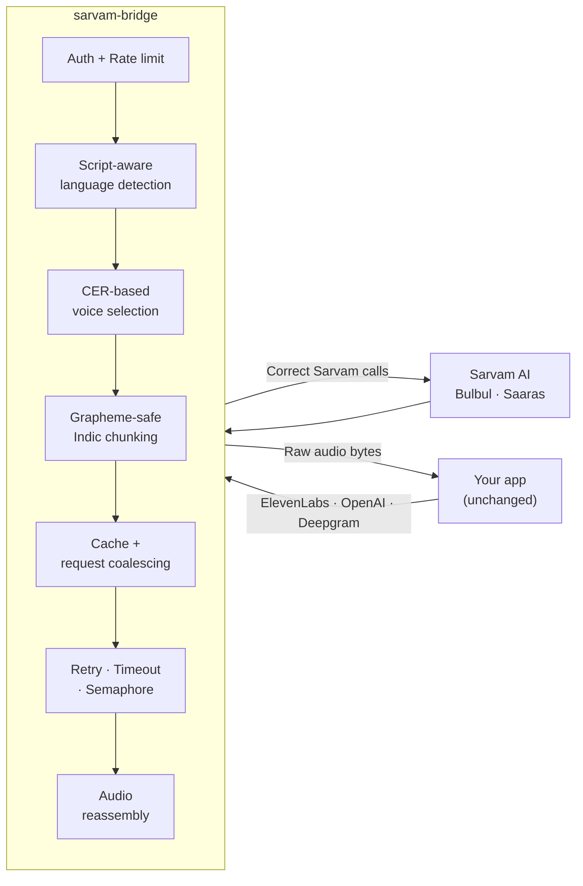

<div align="center">

# 🌉 sarvam-bridge

### Run your existing ElevenLabs, OpenAI or Deepgram app on **Sarvam AI** — by changing one line.

[](LICENSE)
[](https://nodejs.org)
[](https://www.typescriptlang.org/)
[](#-testing)
[](#-security)
[](#-docker)
[](#-contributing)

```diff
- const client = new ElevenLabs({ apiKey: process.env.ELEVENLABS_API_KEY });
+ const client = new ElevenLabs({ apiKey: "unused", environment: "http://localhost:8080" });
```

**That's the entire migration.**

No SDK swap · No base64 decoding · No chunking logic · No language-code plumbing

</div>

---

## 📋 Table of contents

- [The problem](#-the-problem)
- [What this solves](#-what-this-solves)
- [How it works](#-how-it-works)
- [Quick start](#-quick-start)
- [Supported endpoints](#-supported-endpoints)
- [The hard parts](#-the-hard-parts)
- [Cost efficiency](#-cost-efficiency)
- [Security](#-security)
- [Scale & reliability](#-scale--reliability)
- [Configuration](#-configuration)
- [Docker](#-docker)
- [Testing](#-testing)
- [Benchmarks](#-benchmarks)
- [Honest limitations](#-honest-limitations)
- [Roadmap](#-roadmap)
- [Contributing](#-contributing)
- [Author](#-author)

---

## 🎯 The problem

Sarvam AI builds genuinely excellent Indic speech models. Moving to them is the hard part.

Their documentation is unusually candid about this. The **ElevenLabs → Sarvam migration guide** ends with a section titled **"Common mistakes"** — five distinct bugs every migrating developer hits. One of them they describe as *"the single most common migration bug."*

That list isn't a warning. It's a specification for a missing piece of infrastructure.

> **Indic voice AI does not have a quality problem. It has a switching-cost problem.**
>
> Sarvam maintains **four** separate hand-written migration guides — ElevenLabs, Cartesia, Deepgram and Gemini. Each one asks a developer to read a table and rewrite working code. That friction is the moat protecting incumbents who were never designed for Hindi, Tamil or Hinglish in the first place.

`sarvam-bridge` removes the friction.

---

## ✅ What this solves

Every documented migration mistake becomes **structurally impossible**:

| # | The documented mistake | What the bridge does |
|:-:|---|---|
| 1 | Writing the JSON response straight to disk as audio | Decodes Sarvam's base64 `audios` array server-side and returns **raw audio bytes**, exactly like ElevenLabs |
| 2 | Forgetting the required `language_code` | Resolves it from an explicit param → **Unicode script detection** → configured default |
| 3 | Tuning `pace`/`pitch` instead of picking a better speaker | Maps voices using Sarvam's own published **CER quality data** |
| 4 | Sending `pitch`/`loudness` to `bulbul:v3`, where they silently no-op | Drops them and emits a visible warning header |
| 5 | Exceeding the per-model character limit | **Chunks at Indic sentence boundaries**, then reassembles the audio correctly |

### Before and after

<table>
<tr><th width="50%">❌ Before</th><th width="50%">✅ After</th></tr>
<tr valign="top">
<td>

```js
// Rewrite every call site
const res = await fetch(SARVAM_URL, {
  method: "POST",
  headers: { "api-subscription-key": KEY },
  body: JSON.stringify({
    text: chunk,              // you chunk it
    language_code: "hi-IN",   // you detect it
    speaker: "priya",         // you pick it
    model: "bulbul:v3",
  }),
});

const json = await res.json();
const audio = Buffer.from(      // you decode it
  json.audios.join(""), "base64"
);
// ...and you reassemble the WAVs
```

</td>
<td>

```js
// Change the base URL. Ship.
const res = await fetch(
  `${BRIDGE}/v1/text-to-speech/${voiceId}`, {
    method: "POST",
    headers: { "xi-api-key": "unused" },
    body: JSON.stringify({ text }),
  });

const audio = Buffer.from(await res.arrayBuffer());

// Done. Raw bytes, correct language,
// best speaker, chunked and rejoined.
```

</td>
</tr>
</table>

---

## 🔧 How it works



The gateway speaks **each vendor's dialect on the front** and **Sarvam on the back** — including error bodies, so your existing error handling keeps working too.

---

## 🚀 Quick start

**Requires Node 20+.** Built and verified on Node 22.

```bash
git clone https://github.com/YOUR_GITHUB_USERNAME/sarvam-bridge.git
cd sarvam-bridge

npm install
cp .env.example .env        # add your SARVAM_API_KEY
npm run dev
```

> 🔑 Get a key at **[dashboard.sarvam.ai](https://dashboard.sarvam.ai/)**

### See exactly what it would do — before spending a single credit

```bash
curl -X POST localhost:8080/v1/bridge/explain \
  -H 'content-type: application/json' \
  -d '{"text":"வணக்கம், இது ஒரு சோதனை.","voice":"21m00Tcm4TlvDq8ikWAM"}'
```

```jsonc
{
  "script":   { "language": "ta-IN", "confidence": 1, "mixed": false },
  "language": { "resolved": "ta-IN", "source": "detected" },
  "voice":    {
    "requested": "21m00Tcm4TlvDq8ikWAM",   // Rachel, from ElevenLabs
    "resolved":  "priya",                  // Sarvam's recommended Tamil female voice
    "source":    "known-vendor-id"
  },
  "chunking": { "count": 1, "sizes": [23] },
  "upstreamCallsRequired": 1
}
```

Tamil identified **from the script alone**. Rachel's opaque ElevenLabs ID mapped to `priya` — not an arbitrary pick, but the speaker Sarvam themselves recommend for Tamil.

### Production

```bash
npm run build && npm start      # or:
docker compose up --build
```

---

## 📡 Supported endpoints

<details open>
<summary><b>🎙️ ElevenLabs</b></summary>

| Method | Route | Returns |
|---|---|---|
| `POST` | `/v1/text-to-speech/:voice_id` | Raw audio bytes |
| `POST` | `/v1/text-to-speech/:voice_id/stream` | Progressive audio |
| `GET` | `/v1/voices` | ElevenLabs-shaped catalogue of all 39 Sarvam speakers |
| `GET` | `/v1/voices/:voice_id` | Single voice |
| `GET` | `/v1/models` | Model list with per-model character limits |

</details>

<details open>
<summary><b>🤖 OpenAI Audio</b></summary>

| Method | Route | Returns |
|---|---|---|
| `POST` | `/v1/audio/speech` | Raw audio bytes |
| `POST` | `/v1/audio/transcriptions` | `json` · `text` · `srt` · `vtt` · `verbose_json` |
| `POST` | `/v1/audio/translations` | Sarvam's translate mode |

</details>

<details open>
<summary><b>📝 Deepgram</b></summary>

| Method | Route | Returns |
|---|---|---|
| `POST` | `/v1/listen` | `results.channels[0].alternatives[0].transcript` |

</details>

<details>
<summary><b>⚙️ Operations</b></summary>

| Method | Route | Purpose |
|---|---|---|
| `GET` | `/healthz` | Liveness — never depends on Sarvam |
| `GET` | `/readyz` | Readiness |
| `GET` | `/metrics` | Prometheus exposition |
| `POST` | `/v1/bridge/explain` | **Free dry-run** of the translation |

</details>

> **Chat completions are deliberately absent.** Sarvam already exposes an OpenAI-compatible `/chat/completions`. Proxying it would add a hop and buy nothing.

---

## 🧠 The hard parts

This is what separates it from a proxy anyone could write in an afternoon.

<details open>
<summary><b>Script-aware language detection</b></summary>

<br>

`language_code` is **required** by Sarvam and **never sent** by ElevenLabs, OpenAI or Deepgram clients.

The bridge counts codepoints per Unicode block and resolves the dominant Indic script — so a mostly-Tamil string containing one stray Devanagari character still resolves to Tamil. Code-mixed input (Hinglish) is detected and flagged.

**The Odia trap:** ISO-639 calls it `or`. Sarvam expects `od-IN`. A migrating client sending `or` gets a 400 with no hint why. The bridge translates it.

</details>

<details open>
<summary><b>Voice selection from published quality data</b></summary>

<br>

Sarvam scores speakers by **Critical Error Rate** and publishes the best per language. That guidance is encoded, not guessed:

| Language | Recommended |
|---|---|
| Punjabi (male) | `mani` |
| English (male) | `ratan` |
| Hindi, Telugu, Kannada, Odia, Malayalam (male) | `shubh` |
| Most languages (female) | `priya`, `ishita` |

`varun` is **excluded from automatic selection** despite an excellent CER, because Sarvam flags it as a dramatic villain/suspense voice. Great in a thriller, wrong in a banking IVR.

Speaker sets are also **not interchangeable between `bulbul:v2` and `bulbul:v3`** — the bridge validates and remaps across generations while preserving gender.

</details>

<details open>
<summary><b>Grapheme-safe Indic chunking</b></summary>

<br>

Splitting a string by code unit can separate a consonant from its **matra**. The text renders as garbage and the audio comes out wrong.

- Hard splits go through `Intl.Segmenter` at grapheme granularity
- Sentence splitting understands the **danda (।)** and **double danda (॥)**, not just `.`
- A terminator is only a boundary when the next character isn't a combining mark

</details>

<details open>
<summary><b>Correct audio reassembly</b></summary>

<br>

Chunked input means one WAV back **per chunk**. `Buffer.concat` on whole WAV files leaves 44-byte RIFF headers embedded mid-stream, which decoders play as **audible clicks**.

The bridge parses each RIFF container, extracts the PCM payload, and emits **one correct header**. Frame-based codecs (MP3, AAC, Opus) pass through untouched.

</details>

---

## 💰 Cost efficiency

IVR menus, collection scripts and tutor prompts synthesise the **same strings thousands of times a day** — each one billable, each returning byte-identical audio.

**Two mechanisms, because they solve different problems:**

| Mechanism | Solves | Result |
|---|---|---|
| **Bounded LRU cache** (byte budget + TTL) | *Sequential* duplicates | Repeat requests cost **zero** upstream calls |
| **Single-flight coalescing** | *Concurrent* duplicates | 100 simultaneous identical requests → **1** upstream call |

The cache alone doesn't help a burst: a broadcast goes out, 300 callers hit the same menu prompt within one second, and they **all miss the cache** before any of them populates it. Coalescing collapses them into one call whose result every waiter shares.

Cache keys are built from the **resolved** upstream parameters — so two callers arriving in *different vendor dialects* that normalise to the same Sarvam call share one entry. The same mechanism deduplicates repeated chunks *within* a single long request.

Hit ratio and coalescing counts are exported to Prometheus.

---

## 🔐 Security

| Control | Implementation |
|---|---|
| **API key isolation** | The Sarvam key lives **only** in the gateway's environment. Client apps and devices never hold it. Rotating it needs no downstream redeploy. |
| **Credential handling** | Inbound credentials are compared in **constant time**, hashed before touching a log line, and **never forwarded upstream** — there's a test asserting exactly this. |
| **Proxy spoofing** | `X-Forwarded-*` is **not trusted by default**. `req.ip` buckets the rate limiter, so blind trust would let a caller forge a fresh identity per request and bypass it entirely. |
| **Header injection** | All caller-derived header values are sanitised to latin1 with CR/LF stripped. |
| **Input validation** | Zod schemas on every route. Config validated at boot — misconfiguration fails **immediately**, not at first request. |
| **Container** | Runs unprivileged, read-only filesystem, `no-new-privileges`. |
| **Supply chain** | Exact-pinned dependencies, 5 production packages, **0 vulnerabilities**. |

---

## 📈 Scale & reliability

- **Stateless** — scaling is just more replicas
- **Bounded upstream concurrency** via semaphore, so a traffic spike can't stampede Sarvam into rate-limiting you
- **Full-jitter retries** rather than fixed backoff — synchronised retries from many workers are what turn a brief 429 into an outage
- **Separate liveness and readiness** — conflating them means a bad minute at Sarvam makes your orchestrator start killing healthy pods
- **Graceful shutdown** drains in-flight requests, so rolling deploys don't truncate audio mid-response

---

## ⚙️ Configuration

Every option is environment-driven and validated at boot. See [`.env.example`](.env.example).

| Variable | Default | Purpose |
|---|---|---|
| `SARVAM_API_KEY` | *required* | Your Sarvam key — the only secret |
| `PORT` | `8080` | Listen port |
| `DEFAULT_TTS_MODEL` | `bulbul:v3` | `bulbul:v2` or `bulbul:v3` |
| `DEFAULT_STT_MODEL` | `saaras:v3` | Transcription model |
| `GATEWAY_AUTH_TOKEN` | *empty* | Require a client credential; rotate independently of the Sarvam key |
| `CACHE_MAX_BYTES` | `256MB` | Resident-set ceiling for cached audio |
| `CACHE_TTL_SECONDS` | `3600` | Cache lifetime |
| `UPSTREAM_CONCURRENCY` | `8` | Max parallel calls to Sarvam |
| `UPSTREAM_MAX_RETRIES` | `3` | Retries on 429/5xx/network |
| `RATE_LIMIT_CAPACITY` | `60` | Token bucket burst size |
| `TRUST_PROXY` | *off* | Set to your proxy IPs/CIDRs behind a load balancer |
| `VOICE_MAP` | *empty* | Explicit `{"vendor_id":"sarvam_speaker"}` mapping |
| `STRICT_COMPAT` | `false` | Fail on unmappable params instead of warning |

---

## 🐳 Docker

```bash
export SARVAM_API_KEY=your_key_here
docker compose up --build
```

Multi-stage build, dev dependencies pruned, runs as the unprivileged `node` user with a read-only root filesystem.

---

## 🧪 Testing

```bash
npm run typecheck   # strict TS, noUncheckedIndexedAccess
npm test            # 168 tests, ~14s
npm run build
node scripts/smoke.mjs http://localhost:8080
```

Everything runs against a **stubbed upstream** — no network or API key needed.

| Suite | Coverage |
|---|---|
| `routes` | Vendor dialect fidelity — bytes not JSON, error shapes, credential isolation |
| `adversarial` | Header injection, malformed bodies, hostile text, upstream misbehaviour |
| `property` | **~12,000 generated inputs** per run, asserting invariants over chunking, language, voice and audio |
| `stress` | Concurrency ceilings, semaphore leak detection, memory bounds under churn |
| `matrix` | Every language × codec × sample rate × model × voice combination |
| `chunk` · `audio` · `cache` · `ratelimit` · `config` · `voices` · `languages` | Unit level |

### 🐛 Bugs this suite caught — all would have reached production

> **A voice ID containing Devanagari or an emoji crashed the process.** Node throws when writing a non-latin1 header value. Ordinary input, in the exact languages this gateway exists to serve, was a **remote denial-of-service**.

> **Framework errors collapsed to 500** instead of 413/400/415 — meaning client errors would page an on-call engineer at 3am.

> **A long run of orphan combining marks parses as a *single* grapheme cluster,** so the chunker emitted it whole and blew past Sarvam's character ceiling — a guaranteed 422.

> **Sentence splitting broke a grapheme cluster** when a danda was followed by a combining mark.

> **A coalescing test passed for the wrong reason** — the cache was masking it. With the cache disabled and realistic latency, it failed.

---

## 📊 Benchmarks

Compiled build, real HTTP, concurrency 100:

| Scenario | Result |
|---|---|
| 2,000 requests | **100% success** · p50 `150ms` · p95 `422ms` · p99 `518ms` |
| 1,500 adversarial + malformed requests | **Zero 5xx** — every rejection a clean 400/404 |
| 2,800 sustained requests | RSS plateaus at **118MB**, flat across rounds |
| 30 injected failures + timeouts | **No semaphore leaks** |
| 100 concurrent identical requests | **1** upstream call |

---

## ⚠️ Honest limitations

I'd rather you know these up front than discover them in production.

- **No word-level timestamps.** Sarvam's synchronous REST endpoint returns a transcript without timings, so `srt`/`vtt`/`verbose_json` emit a single cue spanning the clip. Fabricated segment boundaries would *look* right and *be* wrong. Use Sarvam's Batch API for real segmentation with diarisation.
- **No confidence scores.** Deepgram responses report `1.0` rather than an invented value.
- **Streaming is chunk-progressive, not token-progressive.** It uses the synchronous endpoint per chunk. Sarvam's native WebSocket TTS would give lower time-to-first-audio.
- **No URL ingestion** on `/v1/listen` — send bytes.
- **`stability`, `similarity_boost`, `style`, `use_speaker_boost`, `instructions`** have no Sarvam equivalent. They're reported via `x-sarvam-bridge-warnings` rather than silently dropped. Set `STRICT_COMPAT=true` to make them hard errors in CI.
- **The built-in ElevenLabs voice-ID map covers well-known stock voices only.** Voice IDs are opaque and account-specific — use `VOICE_MAP` for anything real.

---

## 🗺️ Roadmap

- [ ] Native Sarvam **WebSocket streaming** for lower time-to-first-audio
- [ ] **Batch API** passthrough for word-level timestamps and diarisation
- [ ] Optional **Redis-backed cache** for multi-replica deployments (the `CacheStore` interface already allows it)
- [ ] **Cartesia** and **Google TTS** dialects
- [ ] Published Docker image + Helm chart
- [ ] Pronunciation dictionary support

---

## 🤝 Contributing

Issues and PRs welcome — especially:

- Corrections if I've read the Sarvam API wrong anywhere
- Additional vendor dialects
- Real-world `VOICE_MAP` mappings from production migrations

```bash
npm install && npm test    # everything runs offline
```

---

## 📄 License

MIT — see [LICENSE](LICENSE).

> **Not affiliated with or endorsed by Sarvam AI, ElevenLabs, OpenAI or Deepgram.**
> API shapes implemented against public documentation.

---

## 👤 Author

**Kartikeya Mishra**

Indie founder & full-stack AI engineer, building for Indian languages.

[](https://www.linkedin.com/in/thekartikeyamishra)
[](mailto:kartikeyamishra099@gmail.com)

---

<div align="center">

**If this saved you a migration, a ⭐ helps others find it.**

<sub>Built in Bengaluru 🇮🇳 · Made for Indic voice AI</sub>

</div>
